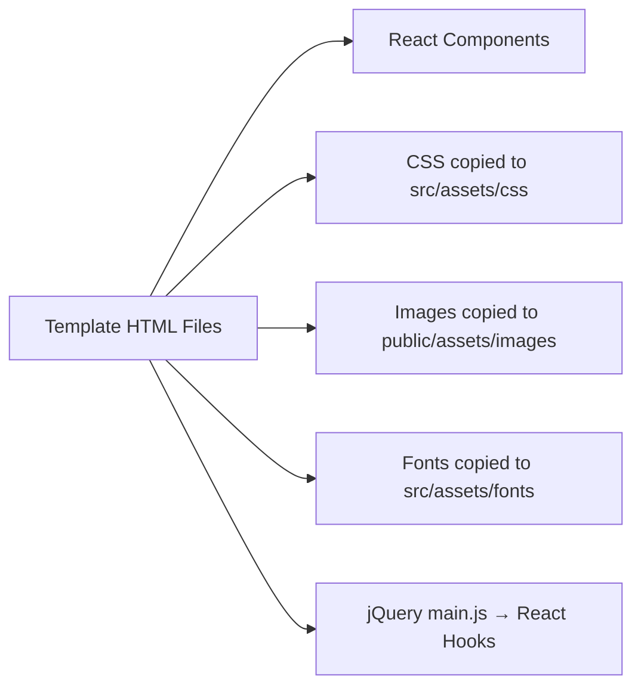
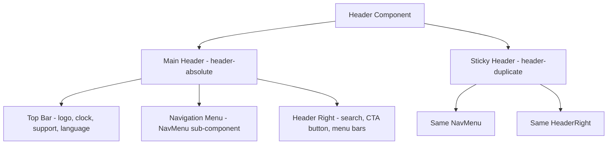
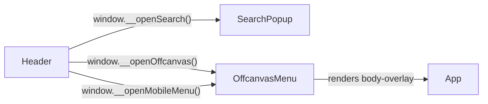

# Tekmino React — Complete Project Documentation

> This document explains the full architecture of the **Tekmino HTML → React** migration: how every piece connects, where assets live, and how to make changes.

---

## Table of Contents

1. [Project Overview](#1-project-overview)
2. [Folder Structure](#2-folder-structure)
3. [Assets — Images, Fonts & Icons](#3-assets--images-fonts--icons)
4. [CSS Architecture](#4-css-architecture)
5. [Component Architecture](#5-component-architecture)
6. [Hooks — JS Functionality](#6-hooks--js-functionality)
7. [Pages](#7-pages)
8. [Routing](#8-routing)
9. [How To Guides](#9-how-to-guides)
10. [Common Pitfalls](#10-common-pitfalls)

---

## 1. Project Overview

This project converts the **Tekmino HTML template** (static `.html` files with jQuery) into a **React SPA** powered by **Vite**.



| Technology | Purpose |
|---|---|
| **Vite** | Dev server & bundler |
| **React 19** | UI framework |
| **React Router v7** | Client-side routing |
| **Swiper** | Slider/carousel (replaces jQuery Swiper) |
| **Bootstrap 5** | Grid system & utilities |
| **GSAP** | Scroll animations (optional) |

---

## 2. Folder Structure

```
penzarit/
├── Template/Template/          ← ORIGINAL HTML template (reference only)
│   ├── assets/css/             ← Original CSS files
│   ├── assets/js/              ← Original jQuery JS files  
│   ├── assets/fonts/           ← Icon font files
│   ├── assets/images/          ← All images
│   └── *.html                  ← Static HTML pages
│
├── public/                     ← STATIC FILES (served as-is by Vite)
│   └── assets/
│       ├── fonts/              ← Icon font files (for public CSS)
│       └── images/             ← ALL images (logos, hero, team, etc.)
│           ├── 404/
│           ├── about/
│           ├── bg/
│           ├── blog/
│           ├── brands/
│           ├── counter/
│           ├── cta/
│           ├── features/
│           ├── footer/
│           ├── hero/
│           ├── hosting/
│           ├── icons/
│           ├── insights/
│           ├── integration/
│           ├── location/
│           ├── logos/          ← primary-logo.webp, logo-icon.webp
│           ├── process/
│           ├── product/
│           ├── project/
│           ├── secure/
│           ├── services/
│           ├── shapes/
│           ├── slider/
│           ├── team/
│           └── testimonial/
│
├── src/                        ← REACT SOURCE CODE
│   ├── assets/
│   │   ├── css/
│   │   │   ├── main.css        ← Main template styles (688KB)
│   │   │   ├── shop.css        ← Shop page styles
│   │   │   ├── tekmino-icon.css← Icon font definitions (tji-*)
│   │   │   ├── nice-select.css ← Custom select dropdown styles
│   │   │   └── meanmenu.css    ← Mobile menu styles
│   │   └── fonts/
│   │       ├── tekmino-icon.eot
│   │       ├── tekmino-icon.ttf
│   │       ├── tekmino-icon.woff
│   │       └── tekmino-icon.svg
│   │
│   ├── components/
│   │   ├── layout/
│   │   │   ├── Header.jsx      ← Main navigation + sticky header
│   │   │   ├── Footer.jsx      ← Footer with widgets
│   │   │   ├── Preloader.jsx   ← Loading spinner animation
│   │   │   ├── BackToTop.jsx   ← Scroll-to-top button
│   │   │   ├── SearchPopup.jsx ← Fullscreen search overlay
│   │   │   └── OffcanvasMenu.jsx ← Side menu + mobile nav + body overlay
│   │   ├── common/
│   │   │   ├── PrimaryBtn.jsx
│   │   │   └── SectionHeading.jsx
│   │   └── home/              ← (page-specific components)
│   │
│   ├── hooks/
│   │   ├── useTemplateInit.js  ← MASTER HOOK — all JS functionality
│   │   └── useGsapAnimation.js ← GSAP scroll animations (optional)
│   │
│   ├── pages/                  ← One file per page
│   │   ├── Index.jsx           ← Homepage (IT Solution)
│   │   ├── Index2.jsx          ← IT Consulting variant
│   │   ├── Index3.jsx          ← Managed IT variant
│   │   ├── ...                 ← (Index4-10, IndexRtl)
│   │   ├── About.jsx
│   │   ├── Service.jsx
│   │   ├── ServiceDetails.jsx
│   │   ├── Contact.jsx
│   │   ├── Blog.jsx
│   │   ├── BlogDetails.jsx
│   │   ├── Shop.jsx
│   │   ├── ShopDetails.jsx
│   │   ├── Cart.jsx
│   │   ├── Wishlist.jsx
│   │   ├── Checkout.jsx
│   │   ├── Team.jsx
│   │   ├── TeamDetails.jsx
│   │   ├── Project.jsx
│   │   ├── ProjectDetails.jsx
│   │   ├── Faq.jsx
│   │   ├── Pricing.jsx
│   │   ├── Login.jsx
│   │   ├── Password.jsx
│   │   └── Error.jsx
│   │
│   ├── App.jsx                 ← Root component + routes
│   ├── App.css                 ← App-level overrides (kept minimal)
│   ├── index.css               ← Global reset (kept minimal)
│   └── main.jsx                ← Entry point + CSS imports
│
├── index.html                  ← Vite entry HTML
├── package.json
└── vite.config.js
```

---

## 3. Assets — Images, Fonts & Icons

### 3.1 Images

> [!IMPORTANT]
> All images live in **`public/assets/images/`**. They are served at the URL `/assets/images/...` by Vite.

**In JSX, always use absolute paths starting with `/`:**

```jsx
// ✅ CORRECT — works on all routes


// ❌ WRONG — breaks on sub-routes like /about

```

**Why?** In a React SPA, the browser URL changes (e.g., `/about`) but no new HTML is loaded. Relative paths resolve against the current URL path, so `assets/...` on `/about` becomes `/about/assets/...` which fails.

**To add a new image:**
1. Place the file in `public/assets/images/<category>/`
2. Reference it as `/assets/images/<category>/filename.webp`

### 3.2 Background Images (`data-bg-image`)

The template uses a custom `data-bg-image` attribute. In React, this is handled by `useTemplateInit.js`:

```html
<!-- In the template HTML -->
<div class="hero-bg" data-bg-image="assets/images/hero/hero-bg.webp"></div>
```

```jsx
// In React JSX — same syntax, the hook handles it automatically
<div className="hero-bg" data-bg-image="/assets/images/hero/hero-bg.webp"></div>
```

The hook runs on every route change and converts all `data-bg-image` values into CSS `background-image`.

### 3.3 Icon Fonts (tji-* icons)

The project uses a **custom icon font** called `tekmino-icon`. The icons are used via CSS classes:

```jsx
<i className="tji-search"></i>      // Search icon
<i className="tji-arrow-right-2"></i> // Arrow icon
<i className="tji-facebook"></i>     // Facebook icon
```

**How it works:**

```
src/assets/css/tekmino-icon.css   ← Defines @font-face + all icon classes
      ↓ references
src/assets/fonts/tekmino-icon.*   ← The actual font files (eot, ttf, woff, svg)
```

The CSS uses relative paths: `url("../fonts/tekmino-icon.woff")` — since the CSS is at `src/assets/css/`, it resolves to `src/assets/fonts/`.

**All available icons** are defined in [tekmino-icon.css](file:///e:/website-project/penzarit/src/assets/css/tekmino-icon.css). Each icon has a class like `.tji-<name>` and a `::before` pseudo-element with a Unicode content value.

> [!TIP]
> To find an icon, search `tekmino-icon.css` for the name. Common icons: `tji-search`, `tji-phone`, `tji-envelop`, `tji-location`, `tji-arrow-right-2`, `tji-facebook`, `tji-instagram`, `tji-linkedin`, `tji-x-twitter`.

---

## 4. CSS Architecture

### 4.1 CSS Loading Order

Defined in [main.jsx](file:///e:/website-project/penzarit/src/main.jsx):

```jsx
// 1. Bootstrap grid & utilities
import 'bootstrap/dist/css/bootstrap.min.css';

// 2. Icon font definitions
import './assets/css/tekmino-icon.css';

// 3. Nice select dropdown styles
import './assets/css/nice-select.css';

// 4. Swiper slider base styles
import 'swiper/css';

// 5. Mean menu (mobile menu) styles
import './assets/css/meanmenu.css';

// 6. MAIN template CSS (all components, sections, animations)
import './assets/css/main.css';

// 7. Shop-specific CSS
import './assets/css/shop.css';

// 8. Minimal global reset
import './index.css';
```

> [!WARNING]
> **Order matters!** `main.css` must come after Bootstrap so template styles override Bootstrap defaults. `index.css` comes last for any final overrides.

### 4.2 Key CSS Files

| File | Size | Purpose |
|------|------|---------|
| `main.css` | 688KB | **ALL** template styles — headers, banners, sections, buttons, cards, animations, utilities |
| `shop.css` | 196KB | Shop page styles — product grids, cart, checkout |
| `tekmino-icon.css` | 6KB | `@font-face` + 100+ icon class definitions |
| `nice-select.css` | 4KB | Custom `<select>` dropdown styling |
| `meanmenu.css` | 3KB | Mobile responsive menu styling |

### 4.3 Modifying Styles

**To change a template style:**
1. **DO NOT edit `main.css`** (it's compiled from SASS)
2. Add your override in `index.css` or `App.css`
3. Use the same selector with higher specificity or `!important`

```css
/* index.css — Override example */
.tj-primary-btn {
  background-color: #your-color !important;
}
```

**To add new styles for custom components:**
- Add them to `App.css` or create a new CSS file and import it in `main.jsx`

---

## 5. Component Architecture

### 5.1 Layout Components

These are rendered **once** in `App.jsx` and persist across all pages:

#### Header.jsx


**Key features:**
- Two `<header>` elements: one absolute (original), one sticky (appears on scroll up)
- Sticky logic uses React `useState` + scroll event listener
- Buttons call `window.__openSearch`, `window.__openOffcanvas`, `window.__openMobileMenu` (exposed by sibling components)

#### OffcanvasMenu.jsx
Contains **THREE** elements:
1. **Body Overlay** (`.body-overlay`) — dark backdrop when menus are open
2. **Offcanvas Menu** (`.tj-offcanvas-area`) — desktop side panel
3. **Mobile Hamburger Menu** (`.hamburger-area`) — full mobile navigation

**State management:**
- `offcanvasOpen` / `mobileOpen` — React state
- Exposes `window.__openOffcanvas()` and `window.__openMobileMenu()` for Header to call
- `closeAll()` resets state and removes `overflow-hidden` from `<body>`

#### SearchPopup.jsx
- Manages `isOpen` state
- Exposes `window.__openSearch()` for Header's search button
- Renders overlay + search form

#### Preloader.jsx
- Three phases: `loading` → `loaded` → `hidden`
- 1 second loading animation, then 0.6s fade out, then unmounts

#### BackToTop.jsx
- Shows/hides based on scroll position (> 1200px)
- Smooth scrolls to top on click

#### Footer.jsx
- Sets its own `data-bg-image` via `useEffect`
- Auto-updates copyright year

### 5.2 Component Communication



> [!NOTE]
> Components communicate via `window` globals instead of React context because the menu open/close behavior is a UI effect, not shared state that other components need to react to.

---

## 6. Hooks — JS Functionality

### 6.1 useTemplateInit.js (MASTER HOOK)

This is the **most important file** — it replaces the entire `main.js` (jQuery) from the template.

**Location:** [src/hooks/useTemplateInit.js](file:///e:/website-project/penzarit/src/hooks/useTemplateInit.js)

**Called once** in `App.jsx` inside `<BrowserRouter>`.

#### What it does (organized by feature):

| Function | What it replaces | When it runs |
|----------|-----------------|--------------|
| `fixImagePaths()` | N/A (SPA fix) | Every route change |
| `applyBgImages()` | `$("[data-bg-image]").each(...)` | Every route change |
| `initStarRatings()` | `$(".star-ratings").each(...)` | Every route change |
| `initSwipers()` | All `new Swiper(...)` calls | Every route change |
| `initProgressBars()` | `progressBarController()` | Every route change |
| `initAccordion()` | `$(".accordion_item .accordion_title")` | Every route change |
| `initPricingToggle()` | `$(".toggle-checkbox").on("change")` | Every route change |
| `initHoverEffects()` | Multiple hover handlers | Every route change |
| `initRoundedMarquee()` | `initRoundedMarquee()` | Every route change + resize |
| `initQuantity()` | `tjQuantityController()` | Every route change |
| `initCopyrightYear()` | Copyright year updater | Every route change |
| `initBackToTop()` | `back_to_top()` | Once on mount |
| `initStickyHeader()` | `stickyMenu()` | Once on mount |
| `initMenus()` | Mobile menu + offcanvas handlers | Once on mount |
| `initSearch()` | Search popup handlers | Once on mount |

#### How Swiper initialization works:

```javascript
// Dynamic import to avoid bundling issues
import('swiper').then(({ default: Swiper }) => {
  import('swiper/modules').then(({ Navigation, Pagination, Autoplay, ... }) => {
    // Initialize each slider only if its container exists in the DOM
    if (document.querySelector('.client-slider')) {
      new Swiper('.client-slider', { modules: [Autoplay, FreeMode], ... });
    }
    // ... more sliders
  });
});
```

#### Route change behavior:

```javascript
useEffect(() => {
  // Runs on EVERY route/page change
  const timer = setTimeout(() => {
    fixImagePaths();      // Fix any relative image paths
    applyBgImages();      // Set CSS background-image from data attributes
    initSwipers();        // Re-initialize any sliders on the new page
    // ... other page-specific initializations
  }, 100);  // 100ms delay ensures DOM is rendered

  window.scrollTo(0, 0); // Scroll to top on navigation
  return () => clearTimeout(timer);
}, [location.pathname]);  // Triggers when URL path changes
```

### 6.2 useGsapAnimation.js

Currently **empty** — for GSAP scroll animations.

**To enable GSAP animations:**
1. Import GSAP and ScrollTrigger
2. Register the plugin
3. Add animation logic for classes like `tj-fade-anim`, `tj-split-text-1`, etc.

```javascript
import { useEffect } from 'react';
import gsap from 'gsap';
import { ScrollTrigger } from 'gsap/ScrollTrigger';

gsap.registerPlugin(ScrollTrigger);

export default function useGsapAnimation() {
  useEffect(() => {
    // Fade animations
    gsap.utils.toArray('.tj-fade-anim').forEach(el => {
      gsap.from(el, {
        opacity: 0,
        y: 30,
        duration: 1,
        scrollTrigger: { trigger: el, start: 'top 85%' }
      });
    });
  }, []);
}
```

---

## 7. Pages

Each page in `src/pages/` corresponds to one HTML file from the template.

### 7.1 Page Structure

Every page is a **functional React component** that returns the page content (WITHOUT header/footer — those are in App.jsx):

```jsx
// src/pages/About.jsx
import { Link } from 'react-router-dom';

export default function About() {
  return (
    <>
      {/* Breadcrumb */}
      <div className="breadcrumb-section ...">...</div>
      
      {/* About Section */}
      <section className="tj-about-section ...">...</section>
      
      {/* Team Section */}
      <section className="tj-team-section ...">...</section>
      
      {/* CTA Section */}
      <section className="tj-cta-section ...">...</section>
    </>
  );
}
```

### 7.2 Template → React Conversion Rules

| HTML Template | React JSX |
|---|---|
| `class="..."` | `className="..."` |
| `<a href="about.html">` | `<Link to="/about">` |
| `style="width: 90%"` | `style={{width: "90%"}}` or `style={{"width":"90%"}}` |
| `stroke-width="1.5"` | `strokeWidth="1.5"` |
| `stroke-linecap="round"` | `strokeLinecap="round"` |
| `for="input-id"` | `htmlFor="input-id"` |
| `value="text"` (on input) | `defaultValue="text"` |
| `autocomplete="off"` | `autoComplete="off"` |
| `data-bg-image="..."` | Same (handled by hook) |
| Inline `<script>` | Moved to hook or useEffect |

### 7.3 Mapping Template HTML → React Pages

| Template File | React Page | Route |
|---|---|---|
| `index.html` | `Index.jsx` | `/` |
| `index-2.html` | `Index2.jsx` | `/index2` |
| `index-3.html` | `Index3.jsx` | `/index3` |
| ... | ... | ... |
| `index-10.html` | `Index10.jsx` | `/index10` |
| `index-rtl.html` | `IndexRtl.jsx` | `/indexrtl` |
| `about.html` | `About.jsx` | `/about` |
| `service.html` | `Service.jsx` | `/service` |
| `service-details.html` | `ServiceDetails.jsx` | `/servicedetails` |
| `contact.html` | `Contact.jsx` | `/contact` |
| `blog.html` | `Blog.jsx` | `/blog` |
| `blog-details.html` | `BlogDetails.jsx` | `/blogdetails` |
| `shop.html` | `Shop.jsx` | `/shop` |
| `shop-details.html` | `ShopDetails.jsx` | `/shopdetails` |
| `cart.html` | `Cart.jsx` | `/cart` |
| `wishlist.html` | `Wishlist.jsx` | `/wishlist` |
| `checkout.html` | `Checkout.jsx` | `/checkout` |
| `team.html` | `Team.jsx` | `/team` |
| `team-details.html` | `TeamDetails.jsx` | `/teamdetails` |
| `project.html` | `Project.jsx` | `/project` |
| `project-details.html` | `ProjectDetails.jsx` | `/projectdetails` |
| `faq.html` | `Faq.jsx` | `/faq` |
| `pricing.html` | `Pricing.jsx` | `/pricing` |
| `login.html` | `Login.jsx` | `/login` |
| `password.html` | `Password.jsx` | `/password` |
| `error.html` | `Error.jsx` | `/error` |

---

## 8. Routing

### 8.1 Setup

Routing is in [App.jsx](file:///e:/website-project/penzarit/src/App.jsx):

```jsx
function App() {
  return (
    <BrowserRouter>
      <AppContent />  {/* Separated so hooks can use useLocation */}
    </BrowserRouter>
  );
}
```

### 8.2 App Structure

```jsx
function AppContent() {
  useTemplateInit();  // Must be inside BrowserRouter

  return (
    <>
      <Preloader />
      <BackToTop />
      <SearchPopup />
      <OffcanvasMenu />    {/* Contains body-overlay */}
      <Header />

      <div id="smooth-wrapper">
        <div id="smooth-content">
          <main id="primary" className="site-main">
            <Routes>
              <Route path="/" element={<Index />} />
              <Route path="/about" element={<About />} />
              {/* ... all routes ... */}
              <Route path="*" element={<Error />} />
            </Routes>
          </main>
        </div>
      </div>

      <Footer />
    </>
  );
}
```

> [!IMPORTANT]
> The `smooth-wrapper` > `smooth-content` > `main#primary.site-main` wrapper structure is required by the template CSS for proper layout.

---

## 9. How-To Guides

### 9.1 Add a New Page

1. **Create the page component:**
   ```jsx
   // src/pages/NewPage.jsx
   import { Link } from 'react-router-dom';
   
   export default function NewPage() {
     return (
       <>
         <div className="breadcrumb-section">...</div>
         <section className="...">
           {/* Your content */}
         </section>
       </>
     );
   }
   ```

2. **Add the route in `App.jsx`:**
   ```jsx
   import NewPage from './pages/NewPage';
   // Inside <Routes>:
   <Route path="/newpage" element={<NewPage />} />
   ```

3. **Add navigation link in `Header.jsx`** (in the NavMenu):
   ```jsx
   <li><Link to="/newpage">New Page</Link></li>
   ```

### 9.2 Add a New Image

1. Place the image in `public/assets/images/<category>/`
2. Use in JSX: `/file.webp" alt="..." />`
3. For background: `<div data-bg-image="/assets/images/<category>/file.webp"></div>`

### 9.3 Add a New Swiper Slider

1. Add the HTML structure in your page JSX:
   ```jsx
   <div className="swiper my-custom-slider">
     <div className="swiper-wrapper">
       <div className="swiper-slide">Slide 1</div>
       <div className="swiper-slide">Slide 2</div>
     </div>
   </div>
   ```

2. Add initialization in `useTemplateInit.js` inside `initSwipers()`:
   ```javascript
   if (document.querySelector('.my-custom-slider')) {
     new Swiper('.my-custom-slider', {
       modules: [Autoplay],
       slidesPerView: 1,
       loop: true,
       autoplay: { delay: 3000 },
     });
   }
   ```

### 9.4 Change the Logo

Replace the file at: `public/assets/images/logos/primary-logo.webp`

The logo is referenced in:
- `Header.jsx` (2 times — main header + sticky header)
- `Footer.jsx`
- `OffcanvasMenu.jsx` (2 times — offcanvas + mobile menu)

### 9.5 Change Colors / Fonts

The template uses **CSS custom properties** defined in `main.css`. To override:

```css
/* src/index.css */
:root {
  --tj-color-primary: #your-color;
  --tj-ff-heading: 'Your Font', sans-serif;
  --tj-ff-body: 'Your Font', sans-serif;
}
```

### 9.6 Add a New Icon

The icon font is fixed — you can only use icons defined in `tekmino-icon.css`. 

If you need additional icons, either:
1. Use a different icon library (e.g., FontAwesome, Lucide)
2. Use inline SVGs
3. Regenerate the icon font with tools like IcoMoon

### 9.7 Modify Header Navigation

Edit the `NavMenu` sub-component inside [Header.jsx](file:///e:/website-project/penzarit/src/components/layout/Header.jsx):

```jsx
const NavMenu = () => (
  <ul>
    <li className="has-dropdown">
      <Link to="/">Home</Link>
      <ul className="sub-menu">
        <li><Link to="/">IT Solution</Link></li>
        {/* Add/remove menu items here */}
      </ul>
    </li>
    {/* Add/remove top-level menu items here */}
  </ul>
);
```

> [!WARNING]
> Also update the mobile menu in [OffcanvasMenu.jsx](file:///e:/website-project/penzarit/src/components/layout/OffcanvasMenu.jsx) — it has its own copy of the navigation links.

---

## 10. Common Pitfalls

### ❌ Images not loading on sub-pages
**Cause:** Using relative paths like `src="assets/images/..."` instead of absolute `src="/assets/images/..."`
**Fix:** Always prefix image paths with `/`

### ❌ Icons showing as empty boxes
**Cause:** Font files missing from `src/assets/fonts/`
**Fix:** Copy font files from `Template/Template/assets/fonts/` to `src/assets/fonts/`

### ❌ Background images not appearing
**Cause:** `data-bg-image` not being converted to CSS
**Fix:** Ensure `useTemplateInit` hook is active and `data-bg-image` uses absolute paths (`/assets/...`)

### ❌ Sliders not working
**Cause:** Swiper not initialized for that specific slider class
**Fix:** Add initialization code in `useTemplateInit.js` → `initSwipers()`

### ❌ Menu/Search/Offcanvas not opening
**Cause:** `window.__openSearch` / `window.__openOffcanvas` / `window.__openMobileMenu` not available
**Fix:** Ensure `SearchPopup` and `OffcanvasMenu` components are mounted BEFORE `Header` in `App.jsx`

### ❌ Page content overlapping header
**Cause:** Missing `<div className="top-space-30"></div>` at the top of the page
**Fix:** Add the spacer div as the first element in your page component

### ❌ CSS not working after changes
**Cause:** CSS specificity or load order
**Fix:** Check import order in `main.jsx`. Template styles in `main.css` are complex — always inspect with browser DevTools.

### ❌ Build fails with JSX errors
**Cause:** HTML attributes not converted to JSX (class → className, for → htmlFor, etc.)
**Fix:** Run the build and fix each error. Common conversions listed in Section 7.2.

---

> [!NOTE]
> This documentation covers the current state of the migration. As you add more features or customizations, update this document accordingly.
